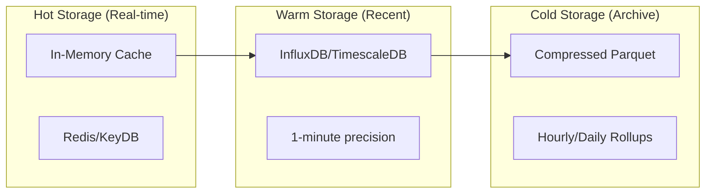

# Data Schema & Storage Design

## Overview

AetherLens uses a hybrid storage approach optimized for time-series data, configuration management, and real-time analytics. This document defines the complete data schema, storage patterns, and indexing strategies.

## Storage Architecture

### Three-Tier Storage Model



### Data Lifecycle

| Age | Storage | Precision | Purpose |
|-----|---------|-----------|----------|
| <1 hour | Memory/Redis | Raw (1s) | Real-time display |
| 1hr-7days | Time-series DB | 1 minute | Detailed analysis |
| 7-30 days | Time-series DB | 5 minutes | Trends & patterns |
| 30-90 days | Time-series DB | 1 hour | Historical comparison |
| >90 days | Parquet files | 1 day | Long-term archive |

## Core Data Models

### 1. Metrics Schema

#### Time-Series Metric
```json
{
  "timestamp": "2024-01-15T10:30:00Z",
  "device_id": "shelly-plug-office-01",
  "metric_type": "power",
  "value": 125.4,
  "unit": "watts",
  "tags": {
    "room": "office",
    "device_type": "smart_plug",
    "circuit": "main_floor_1",
    "user": "john"
  },
  "metadata": {
    "collection_duration_ms": 45,
    "quality_score": 0.99,
    "source": "plugin:shelly:1.2.0"
  }
}
```

#### InfluxDB Schema
```flux
// Measurement: device_metrics
// Tags: device_id, room, device_type, metric_type
// Fields: value, quality_score
// Time: timestamp

device_metrics,device_id=shelly-plug-office-01,room=office,device_type=smart_plug,metric_type=power value=125.4,quality_score=0.99 1705316400000000000
```

#### TimescaleDB Schema
```sql
CREATE TABLE metrics (
    time         TIMESTAMPTZ NOT NULL,
    device_id    TEXT NOT NULL,
    metric_type  TEXT NOT NULL,
    value        DOUBLE PRECISION NOT NULL,
    unit         TEXT NOT NULL,
    tags         JSONB DEFAULT '{}',
    metadata     JSONB DEFAULT '{}'
);

-- Convert to hypertable
SELECT create_hypertable('metrics', 'time');

-- Indexes
CREATE INDEX idx_metrics_device_time ON metrics (device_id, time DESC);
CREATE INDEX idx_metrics_type_time ON metrics (metric_type, time DESC);
CREATE INDEX idx_metrics_tags ON metrics USING GIN (tags);

-- Compression policy (after 7 days)
ALTER TABLE metrics SET (
    timescaledb.compress,
    timescaledb.compress_segmentby = 'device_id',
    timescaledb.compress_orderby = 'time DESC'
);

SELECT add_compression_policy('metrics', INTERVAL '7 days');
```

### 2. Device Registry

#### Device Model
```json
{
  "device_id": "shelly-plug-office-01",
  "name": "Office Desk Plug",
  "type": "smart_plug",
  "manufacturer": "Shelly",
  "model": "Plug S",
  "location": {
    "room": "office",
    "floor": 2,
    "building": "main",
    "coordinates": {
      "lat": 37.7749,
      "lng": -122.4194
    }
  },
  "capabilities": [
    "power_monitoring",
    "on_off_control",
    "scheduling",
    "energy_metering"
  ],
  "configuration": {
    "ip_address": "192.168.1.100",
    "mac_address": "AA:BB:CC:DD:EE:FF",
    "firmware_version": "1.12.2",
    "plugin": "shelly",
    "plugin_config": {
      "polling_interval": 30,
      "auth_method": "basic",
      "timeout_seconds": 5
    }
  },
  "metadata": {
    "installation_date": "2024-01-01T00:00:00Z",
    "warranty_expiry": "2026-01-01T00:00:00Z",
    "purchase_price": 24.99,
    "nominal_power": 2500,
    "tags": ["critical", "always_on"]
  },
  "status": {
    "online": true,
    "last_seen": "2024-01-15T10:30:00Z",
    "error_count": 0,
    "total_runtime_hours": 720
  }
}
```

#### SQLite/PostgreSQL Schema
```sql
CREATE TABLE devices (
    device_id         TEXT PRIMARY KEY,
    name              TEXT NOT NULL,
    type              TEXT NOT NULL,
    manufacturer      TEXT,
    model             TEXT,
    location          JSONB NOT NULL DEFAULT '{}',
    capabilities      TEXT[] DEFAULT '{}',
    configuration     JSONB NOT NULL DEFAULT '{}',
    metadata          JSONB DEFAULT '{}',
    status            JSONB DEFAULT '{}',
    created_at        TIMESTAMP DEFAULT CURRENT_TIMESTAMP,
    updated_at        TIMESTAMP DEFAULT CURRENT_TIMESTAMP
);

CREATE INDEX idx_devices_type ON devices(type);
CREATE INDEX idx_devices_location ON devices USING GIN (location);
CREATE INDEX idx_devices_status ON devices USING GIN (status);
```

### 3. Energy Rates

#### Rate Schedule Model
```json
{
  "rate_id": "utility-tou-summer-2024",
  "provider": "Pacific Gas & Electric",
  "plan_name": "Time-of-Use Summer",
  "effective_date": "2024-06-01",
  "expiry_date": "2024-09-30",
  "currency": "USD",
  "time_zones": "America/Los_Angeles",
  "rate_structure": {
    "type": "time_of_use",
    "periods": [
      {
        "name": "peak",
        "rate": 0.42,
        "unit": "kWh",
        "days": ["monday", "tuesday", "wednesday", "thursday", "friday"],
        "hours": "16:00-21:00"
      },
      {
        "name": "off_peak",
        "rate": 0.24,
        "unit": "kWh",
        "days": ["all"],
        "hours": "00:00-15:00,22:00-23:59"
      },
      {
        "name": "super_off_peak",
        "rate": 0.12,
        "unit": "kWh",
        "days": ["saturday", "sunday"],
        "hours": "00:00-23:59"
      }
    ]
  },
  "fixed_charges": {
    "monthly_service": 10.00,
    "demand_charge": 15.00
  },
  "metadata": {
    "source": "manual_entry",
    "last_verified": "2024-01-15"
  }
}
```

### 4. Cost Calculations

#### Cost Record Model
```json
{
  "calculation_id": "calc-2024-01-15-001",
  "timestamp": "2024-01-15T10:30:00Z",
  "device_id": "shelly-plug-office-01",
  "period": {
    "start": "2024-01-15T10:00:00Z",
    "end": "2024-01-15T10:30:00Z",
    "duration_minutes": 30
  },
  "consumption": {
    "energy_kwh": 0.0627,
    "average_power_w": 125.4,
    "peak_power_w": 145.2
  },
  "cost_breakdown": {
    "energy_cost": 0.015,
    "demand_charge": 0.0,
    "taxes": 0.0012,
    "total": 0.0162
  },
  "rate_applied": {
    "rate_id": "utility-tou-summer-2024",
    "period": "off_peak",
    "rate_per_kwh": 0.24
  },
  "carbon_emissions": {
    "co2_kg": 0.025,
    "intensity_g_per_kwh": 400
  }
}
```

### 5. Alerts & Automations

#### Alert Configuration
```json
{
  "alert_id": "alert-high-consumption-001",
  "name": "High Office Consumption",
  "enabled": true,
  "conditions": {
    "type": "threshold",
    "metric": "power",
    "device_id": "shelly-plug-office-01",
    "operator": "greater_than",
    "threshold": 500,
    "duration_seconds": 300
  },
  "actions": [
    {
      "type": "notification",
      "channels": ["email", "push"],
      "message": "Office plug consuming >500W for 5 minutes"
    },
    {
      "type": "automation",
      "action": "turn_off",
      "delay_seconds": 600
    }
  ],
  "schedule": {
    "active_hours": "00:00-23:59",
    "active_days": ["all"]
  },
  "metadata": {
    "created_by": "user123",
    "created_at": "2024-01-01T00:00:00Z",
    "trigger_count": 5,
    "last_triggered": "2024-01-14T15:30:00Z"
  }
}
```

### 6. User & Preferences

#### User Model
```json
{
  "user_id": "usr-001",
  "username": "johndoe",
  "email": "john@example.com",
  "role": "admin",
  "preferences": {
    "timezone": "America/New_York",
    "currency": "USD",
    "temperature_unit": "celsius",
    "date_format": "YYYY-MM-DD",
    "theme": "dark",
    "dashboard_layout": {
      "widgets": [
        {"type": "current_consumption", "position": [0, 0], "size": [2, 1]},
        {"type": "daily_cost", "position": [2, 0], "size": [1, 1]},
        {"type": "device_list", "position": [0, 1], "size": [3, 2]}
      ]
    },
    "notifications": {
      "email": true,
      "push": true,
      "sms": false,
      "alert_threshold": "medium"
    }
  },
  "api_tokens": [
    {
      "token_id": "tok-001",
      "name": "Home Assistant Integration",
      "permissions": ["read:metrics", "read:devices"],
      "created_at": "2024-01-01T00:00:00Z",
      "last_used": "2024-01-15T10:00:00Z",
      "expires_at": "2025-01-01T00:00:00Z"
    }
  ]
}
```

## Aggregation Patterns

### Continuous Aggregates

#### Hourly Aggregates
```sql
CREATE MATERIALIZED VIEW metrics_hourly
WITH (timescaledb.continuous) AS
SELECT
    time_bucket('1 hour', time) AS hour,
    device_id,
    metric_type,
    AVG(value) as avg_value,
    MIN(value) as min_value,
    MAX(value) as max_value,
    COUNT(*) as sample_count,
    SUM(value) as sum_value,
    percentile_cont(0.95) WITHIN GROUP (ORDER BY value) as p95_value
FROM metrics
GROUP BY hour, device_id, metric_type
WITH NO DATA;

-- Refresh policy
SELECT add_continuous_aggregate_policy('metrics_hourly',
    start_offset => INTERVAL '3 hours',
    end_offset => INTERVAL '1 hour',
    schedule_interval => INTERVAL '1 hour');
```

#### Daily Aggregates
```sql
CREATE MATERIALIZED VIEW metrics_daily
WITH (timescaledb.continuous) AS
SELECT
    time_bucket('1 day', time) AS day,
    device_id,
    metric_type,
    AVG(value) as avg_value,
    MIN(value) as min_value,
    MAX(value) as max_value,
    SUM(CASE WHEN metric_type = 'energy' THEN value ELSE 0 END) as total_energy,
    percentile_cont(0.5) WITHIN GROUP (ORDER BY value) as median_value
FROM metrics
GROUP BY day, device_id, metric_type
WITH NO DATA;
```

### Cost Aggregations

```sql
CREATE MATERIALIZED VIEW daily_costs AS
SELECT
    DATE(timestamp) as date,
    device_id,
    SUM(energy_kwh) as total_kwh,
    SUM(cost_total) as total_cost,
    AVG(rate_per_kwh) as avg_rate,
    MAX(peak_power_w) as peak_power,
    COUNT(DISTINCT rate_period) as rate_periods_used
FROM cost_calculations
GROUP BY DATE(timestamp), device_id;

CREATE INDEX idx_daily_costs_date ON daily_costs(date DESC);
CREATE INDEX idx_daily_costs_device ON daily_costs(device_id);
```

## Caching Strategy

### Redis Cache Schema

#### Real-time Metrics
```redis
# Current power reading
SET metrics:current:shelly-plug-office-01:power 125.4 EX 60

# Recent history (list)
LPUSH metrics:history:shelly-plug-office-01:power "125.4|2024-01-15T10:30:00Z"
LTRIM metrics:history:shelly-plug-office-01:power 0 59

# Daily accumulator
HINCRBY metrics:daily:2024-01-15:shelly-plug-office-01 energy_wh 62.7
HINCRBY metrics:daily:2024-01-15:shelly-plug-office-01 cost_cents 162

# Device status
HSET device:status:shelly-plug-office-01 
  online true 
  last_seen "2024-01-15T10:30:00Z"
  error_count 0
```

#### Calculated Values
```redis
# Hourly cache
SET cache:hourly:2024-01-15-10:office:total_consumption 1254 EX 3600

# Dashboard cache
SET cache:dashboard:usr-001:widgets "...json..." EX 300

# Rate cache
HSET rates:current 
  peak 0.42
  off_peak 0.24
  current_period off_peak
  next_change "2024-01-15T16:00:00Z"
```

## Index Strategies

### Time-Series Indexes
```sql
-- Primary query patterns
CREATE INDEX idx_recent_by_device ON metrics (device_id, time DESC)
  WHERE time > NOW() - INTERVAL '7 days';

CREATE INDEX idx_by_type_recent ON metrics (metric_type, time DESC)
  WHERE time > NOW() - INTERVAL '24 hours';

-- Tag-based queries
CREATE INDEX idx_room_metrics ON metrics USING GIN (tags)
  WHERE tags ? 'room';

-- Cost analysis
CREATE INDEX idx_cost_by_period ON cost_calculations (rate_period, timestamp DESC);
CREATE INDEX idx_cost_by_device_date ON cost_calculations (device_id, DATE(timestamp) DESC);
```

### Configuration Indexes
```sql
-- Device queries
CREATE INDEX idx_devices_online ON devices ((status->>'online'))
  WHERE status->>'online' = 'true';

CREATE INDEX idx_devices_by_room ON devices ((location->>'room'));

-- Alert queries  
CREATE INDEX idx_alerts_enabled ON alerts (enabled, next_check)
  WHERE enabled = true;
```

## Data Retention Policies

### Retention Rules

| Data Type | Raw | 1min | 5min | 1hour | 1day |
|-----------|-----|------|------|-------|------|
| Power Metrics | 1hr | 7d | 30d | 90d | 1yr |
| Energy Totals | - | 7d | 30d | 90d | 5yr |
| Cost Records | - | - | 30d | 90d | 7yr |
| Device Status | 24hr | - | - | 30d | - |
| Alerts | - | - | - | - | 90d |

### Cleanup Procedures

```sql
-- Automated cleanup job
CREATE OR REPLACE FUNCTION cleanup_old_metrics()
RETURNS void AS $$
BEGIN
  -- Delete raw metrics older than 1 hour
  DELETE FROM metrics 
  WHERE time < NOW() - INTERVAL '1 hour'
    AND time_bucket('1 minute', time) IN 
      (SELECT hour FROM metrics_hourly);
  
  -- Archive old aggregates to Parquet
  INSERT INTO archive_queue (table_name, date_range)
  SELECT 'metrics_daily', date_trunc('month', day)
  FROM metrics_daily
  WHERE day < NOW() - INTERVAL '1 year'
  GROUP BY date_trunc('month', day);
END;
$$ LANGUAGE plpgsql;

-- Schedule cleanup
SELECT cron.schedule('cleanup_metrics', '0 2 * * *', 'SELECT cleanup_old_metrics()');
```

## Migration Scripts

### Schema Versioning
```sql
CREATE TABLE schema_versions (
    version INTEGER PRIMARY KEY,
    applied_at TIMESTAMP DEFAULT CURRENT_TIMESTAMP,
    description TEXT
);

-- Example migration
BEGIN;
  -- Check current version
  SELECT version FROM schema_versions ORDER BY version DESC LIMIT 1;
  
  -- Apply migration
  ALTER TABLE devices ADD COLUMN group_id TEXT;
  CREATE INDEX idx_devices_group ON devices(group_id);
  
  -- Record migration
  INSERT INTO schema_versions (version, description)
  VALUES (2, 'Add device grouping support');
COMMIT;
```

## Backup & Recovery

### Backup Strategy
```bash
#!/bin/bash
# Daily backup script

# Time-series data (incremental)
influx backup \
  --bucket aetherlens \
  --start 2024-01-14T00:00:00Z \
  --end 2024-01-15T00:00:00Z \
  /backup/influx/$(date +%Y%m%d)

# Configuration (full)
pg_dump aetherlens_config | gzip > /backup/postgres/config_$(date +%Y%m%d).sql.gz

# Redis snapshot
redis-cli BGSAVE
cp /var/lib/redis/dump.rdb /backup/redis/dump_$(date +%Y%m%d).rdb

# Archive to S3 (optional)
aws s3 sync /backup s3://aetherlens-backup/$(hostname)/
```

### Recovery Procedures
```bash
#!/bin/bash
# Restore from backup

# Stop services
systemctl stop aetherlens

# Restore time-series
influx restore \
  --bucket aetherlens \
  /backup/influx/20240114

# Restore configuration
gunzip < /backup/postgres/config_20240114.sql.gz | psql aetherlens_config

# Restore Redis
cp /backup/redis/dump_20240114.rdb /var/lib/redis/dump.rdb
redis-cli SHUTDOWN NOSAVE
systemctl start redis

# Restart services
systemctl start aetherlens
```

## Performance Optimization

### Query Optimization
```sql
-- Example: Get last 24h consumption by room
WITH latest_readings AS (
  SELECT 
    tags->>'room' as room,
    time,
    value,
    ROW_NUMBER() OVER (PARTITION BY device_id ORDER BY time DESC) as rn
  FROM metrics
  WHERE 
    time > NOW() - INTERVAL '24 hours'
    AND metric_type = 'power'
)
SELECT 
  room,
  AVG(value) as avg_power,
  SUM(value * 0.0167) as energy_wh -- assuming 1min intervals
FROM latest_readings
WHERE rn <= 1440 -- 24 hours * 60 minutes
GROUP BY room;
```

### Batch Processing
```python
# Batch insert example
def batch_insert_metrics(metrics: List[Metric], batch_size: int = 1000):
    """Insert metrics in batches for better performance"""
    for i in range(0, len(metrics), batch_size):
        batch = metrics[i:i + batch_size]
        
        # Build batch insert
        values = [
            f"({m.timestamp},{m.device_id},{m.value})"
            for m in batch
        ]
        
        query = f"""
            INSERT INTO metrics (time, device_id, value)
            VALUES {','.join(values)}
            ON CONFLICT (time, device_id) DO NOTHING
        """
        
        db.execute(query)
```

This comprehensive schema design provides efficient storage, fast queries, and scalable data management for the AetherLens home energy monitoring system.