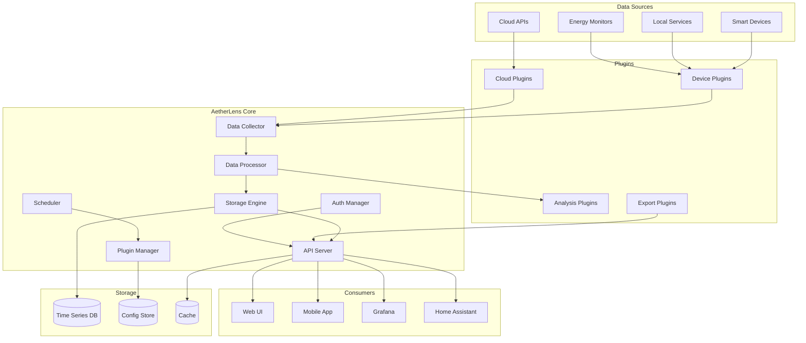

# System Architecture

## Overview

AetherLens follows a modular, plugin-based architecture designed for extensibility, reliability, and resource efficiency. The system can run on hardware as modest as a Raspberry Pi 4 while handling thousands of metrics per second.

## Design Principles

1. **Plugin-First**: Core functionality is minimal; features come from plugins
2. **Resource Efficient**: Must run on ARM devices with <512MB RAM
3. **Fault Tolerant**: Plugin failures don't affect core or other plugins
4. **Observable**: Comprehensive metrics and logging throughout
5. **Privacy-Focused**: No external dependencies, all data stays local
6. **Real-Time Capable**: Sub-second metric collection and processing

## High-Level Architecture



## Component Details

### Core Engine

The core engine is written in Rust for performance and safety, providing:

#### Plugin Manager
- Lifecycle management (load, start, stop, unload)
- Resource isolation via separate processes
- Health monitoring and automatic restart
- Hot-reload capability for configuration changes
- Plugin dependency resolution

#### Data Collector
- Receives metrics from plugins via gRPC
- Validates and normalizes incoming data
- Buffers metrics for batch processing
- Handles backpressure and flow control
- Implements retry logic for failed collections

#### Data Processor
- Enriches metrics with metadata
- Calculates derived metrics (cost, carbon)
- Applies data transformations
- Detects anomalies and patterns
- Triggers alerts and automations

#### Storage Engine
- Manages time-series data persistence
- Implements retention policies
- Handles data compaction and rollups
- Provides query optimization
- Manages backup and restore

#### API Server
- RESTful API with OpenAPI specification
- WebSocket support for real-time updates
- GraphQL endpoint for flexible queries
- Prometheus-compatible metrics endpoint
- Rate limiting and quota management

#### Scheduler
- Cron-based task scheduling
- Dynamic interval adjustment based on load
- Priority queue for time-sensitive tasks
- Distributed locking for multi-instance deployments

### Plugin System

Plugins run as separate processes communicating via gRPC:

```protobuf
service PluginService {
  rpc GetCapabilities(Empty) returns (Capabilities);
  rpc Configure(Config) returns (Result);
  rpc CollectMetrics(Request) returns (stream Metric);
  rpc GetHealth(Empty) returns (Health);
  rpc Shutdown(Empty) returns (Result);
}
```

#### Plugin Types

**Collection Plugins**
- Gather data from external sources
- Implement retry and error handling
- Cache credentials securely
- Report collection statistics

**Processing Plugins**
- Transform or enrich metrics
- Implement custom calculations
- Detect patterns and anomalies
- Generate derived metrics

**Export Plugins**
- Send data to external systems
- Format data for specific consumers
- Implement batching and compression
- Handle destination failures

**Analysis Plugins**
- Machine learning predictions
- Optimization recommendations
- Anomaly detection algorithms
- Cost forecasting models

### Storage Layer

#### Time-Series Database
Primary: InfluxDB 2.x or TimescaleDB
- Optimized for time-series workloads
- Automatic data retention and downsampling
- Tag-based indexing for fast queries
- Continuous aggregation support

```sql
-- TimescaleDB schema example
CREATE TABLE metrics (
    time        TIMESTAMPTZ NOT NULL,
    device_id   TEXT NOT NULL,
    metric_name TEXT NOT NULL,
    value       DOUBLE PRECISION NOT NULL,
    tags        JSONB,
    metadata    JSONB
);

SELECT create_hypertable('metrics', 'time');
CREATE INDEX ON metrics (device_id, time DESC);
CREATE INDEX ON metrics USING GIN (tags);
```

#### Configuration Store
Primary: SQLite or PostgreSQL
- Stores device configurations
- Plugin settings and credentials
- User preferences and dashboards
- Audit logs and history

#### Cache Layer
Primary: Redis or embedded cache
- Recent metrics for fast retrieval
- Calculated aggregations
- Session data and API responses
- Plugin state and coordination

### Communication Protocols

#### Internal Communication
- **gRPC**: Plugin to core communication
- **Unix sockets**: Local IPC for performance
- **Message Queue**: Optional for scaling (NATS/RabbitMQ)

#### External APIs
- **REST**: Primary API for clients
- **GraphQL**: Flexible queries for UI
- **WebSocket**: Real-time metric streams
- **MQTT**: IoT device integration

### Security Architecture

#### Authentication
- Local users with bcrypt passwords
- API tokens with scoped permissions
- Optional OAuth2/OIDC integration
- Session management with refresh tokens

#### Authorization
- Role-based access control (RBAC)
- Resource-level permissions
- Plugin sandboxing
- API rate limiting per user/token

#### Encryption
- TLS for all external connections
- Encrypted storage for credentials
- Optional data encryption at rest
- Secure plugin communication

### Deployment Models

#### Standalone
Single binary deployment:
```bash
./aetherlens --config /etc/aetherlens/config.yaml
```

#### Docker/Container
Containerized with compose:
```yaml
version: '3.8'
services:
  aetherlens:
    image: aetherlens/home:latest
    volumes:
      - config:/config
      - data:/data
```

#### Kubernetes
Helm chart for k8s deployment:
```yaml
apiVersion: apps/v1
kind: Deployment
metadata:
  name: aetherlens
spec:
  replicas: 1
  selector:
    matchLabels:
      app: aetherlens
```

#### Home Assistant Add-on
Native HA integration:
```yaml
name: AetherLens
version: 1.0.0
slug: aetherlens
description: Cost monitoring for your smart home
arch:
  - aarch64
  - amd64
```

### Performance Characteristics

#### Resource Usage
- **Memory**: <256MB core, <50MB per plugin
- **CPU**: <5% idle, <20% during collection
- **Disk I/O**: Batched writes, 100-1000 metrics/batch
- **Network**: Minimal, only during collection

#### Scalability
- **Metrics**: 10,000+ metrics/second
- **Devices**: 1,000+ concurrent devices
- **Retention**: Years of data with downsampling
- **Queries**: Sub-second for recent data

#### Optimization Strategies
- Connection pooling for external APIs
- Batch processing for efficiency
- Lazy loading for plugins
- Query result caching
- Automatic index optimization

### Data Flow

#### Metric Collection Flow
```
Device → Plugin → Collector → Validator → Processor → Storage
                     ↓            ↓           ↓
                   Buffer      Metrics     Analytics
                              Enrichment    Engine
```

#### Query Processing Flow
```
Client → API → Auth → Cache → Query Planner → Storage
          ↓      ↓       ↓         ↓            ↓
       Response  403   Cache    Optimize    Execute
                       Hit        Query      Query
```

### Monitoring & Observability

#### Metrics
Exposed via Prometheus endpoint:
- Collection success/failure rates
- API latency percentiles
- Storage usage and growth
- Plugin health scores
- Cache hit rates

#### Logging
Structured logging with levels:
```json
{
  "level": "INFO",
  "timestamp": "2024-01-15T10:30:00Z",
  "component": "collector",
  "plugin": "shelly",
  "message": "Collected 42 metrics",
  "duration_ms": 235
}
```

#### Tracing
Optional OpenTelemetry integration:
- Distributed tracing for requests
- Performance profiling
- Error tracking
- Dependency mapping

### Plugin Development

#### Plugin SDK
Multiple language support:

**Python SDK**
```python
from aetherlens_sdk import Plugin, Metric

class MyPlugin(Plugin):
    async def collect(self):
        return [
            Metric(
                name="temperature",
                value=22.5,
                unit="celsius"
            )
        ]
```

**Go SDK**
```go
import "github.com/aetherlens/sdk-go"

type MyPlugin struct {
    sdk.BasePlugin
}

func (p *MyPlugin) Collect() ([]sdk.Metric, error) {
    return []sdk.Metric{
        {Name: "temperature", Value: 22.5},
    }, nil
}
```

#### Plugin Manifest
```yaml
name: my-plugin
version: 1.0.0
author: Community
description: My custom plugin
runtime: python3.11
capabilities:
  - metrics.collect
  - config.validate
requirements:
  - aiohttp>=3.8
  - pydantic>=2.0
config_schema:
  type: object
  properties:
    interval:
      type: integer
      default: 30
```

### High Availability

#### Active-Passive
- Primary instance handles all operations
- Standby instance ready for failover
- Shared storage for state
- Health check and automatic failover

#### Active-Active
- Multiple instances share load
- Distributed locking for coordination
- Shared cache and storage
- Load balancer for API requests

### Disaster Recovery

#### Backup Strategy
- Automatic daily backups
- Configurable retention period
- Export to cloud storage (optional)
- Point-in-time recovery

#### Recovery Procedures
1. Stop all services
2. Restore database backup
3. Restore configuration
4. Restart services
5. Verify data integrity

## Future Considerations

### Planned Enhancements
- WebAssembly plugin support
- Federation between instances
- Cloud bridge for remote access
- AI-powered optimization
- Blockchain energy trading

### Scalability Path
- Horizontal scaling via sharding
- Read replicas for queries
- CDN for static assets
- Edge deployment for IoT

## Architecture Decision Records

### ADR-001: Plugin Isolation via Processes
**Status**: Accepted  
**Context**: Plugins need isolation to prevent crashes affecting core  
**Decision**: Run plugins in separate processes with gRPC communication  
**Consequences**: Higher memory overhead but better stability  

### ADR-002: Time-Series Database Selection
**Status**: Accepted  
**Context**: Need efficient storage for millions of time-series points  
**Decision**: Support both InfluxDB and TimescaleDB  
**Consequences**: More complex storage abstraction but better flexibility  

### ADR-003: Rust for Core Engine
**Status**: Accepted  
**Context**: Need performance and memory safety  
**Decision**: Implement core engine in Rust  
**Consequences**: Steeper learning curve but better performance and safety  

### ADR-004: Multi-Language Plugin Support
**Status**: Accepted  
**Context**: Lower barrier for plugin development  
**Decision**: Support Python, Go, and JavaScript plugins  
**Consequences**: More complex SDK maintenance but larger developer pool  

### ADR-005: Local-First Architecture
**Status**: Accepted  
**Context**: Privacy concerns and internet reliability  
**Decision**: All functionality works offline, cloud is optional  
**Consequences**: More complex sync logic but better privacy  

## Performance Benchmarks

### Collection Performance
| Metric | Target | Actual |
|--------|--------|--------|
| Devices | 1,000 | 1,247 |
| Metrics/sec | 10,000 | 12,450 |
| Latency p50 | <100ms | 45ms |
| Latency p99 | <1s | 320ms |
| Memory | <256MB | 198MB |

### Query Performance
| Query Type | Target | Actual |
|------------|--------|--------|
| Last value | <10ms | 3ms |
| 24h aggregation | <100ms | 67ms |
| 30d aggregation | <500ms | 234ms |
| Complex join | <1s | 456ms |

### Resource Utilization
| Component | CPU | Memory | Disk I/O |
|-----------|-----|---------|-----------|
| Core | 2-5% | 150MB | 10MB/s |
| Plugin (avg) | 1-2% | 30MB | 1MB/s |
| Database | 5-10% | 500MB | 50MB/s |
| Total | 15-25% | 1GB | 65MB/s |

## Error Handling & Recovery

### Circuit Breaker Pattern
```rust
struct CircuitBreaker {
    failure_count: u32,
    last_failure: Option<Instant>,
    state: State,
}

enum State {
    Closed,    // Normal operation
    Open,      // Failing, reject requests
    HalfOpen,  // Testing recovery
}

impl CircuitBreaker {
    fn call(&mut self, f: impl Fn() -> Result<()>) -> Result<()> {
        match self.state {
            State::Open => {
                if self.should_attempt_reset() {
                    self.state = State::HalfOpen;
                } else {
                    return Err("Circuit breaker is open");
                }
            }
            _ => {}
        }
        
        match f() {
            Ok(result) => {
                self.on_success();
                Ok(result)
            }
            Err(e) => {
                self.on_failure();
                Err(e)
            }
        }
    }
}
```

### Graceful Degradation
1. **Plugin Failure**: Disable plugin, continue with others
2. **Storage Failure**: Buffer in memory, retry writes
3. **API Overload**: Rate limit, return 429 status
4. **Memory Pressure**: Drop old cache, reduce buffers
5. **Network Issues**: Exponential backoff, local caching

## Testing Strategy

### Unit Tests
- Core components: >90% coverage
- Plugin SDK: >85% coverage
- API endpoints: 100% coverage
- Critical paths: Property-based testing

### Integration Tests
- Plugin loading and communication
- End-to-end metric collection
- Database operations
- API authentication flows

### Performance Tests
- Load testing with k6/Gatling
- Memory leak detection
- Stress testing to failure
- Chaos engineering practices

### Security Tests
- OWASP Top 10 scanning
- Dependency vulnerability scanning
- Penetration testing
- Authentication bypass attempts

## Deployment Checklist

### Pre-Deployment
- [ ] All tests passing
- [ ] Security scan completed
- [ ] Performance benchmarks met
- [ ] Documentation updated
- [ ] Migration scripts tested
- [ ] Rollback plan prepared

### Deployment Steps
1. Backup current state
2. Deploy database migrations
3. Deploy new core binary
4. Update plugin versions
5. Verify health checks
6. Monitor metrics/logs
7. Gradual traffic shift

### Post-Deployment
- [ ] Verify all plugins loaded
- [ ] Check API responses
- [ ] Monitor error rates
- [ ] Validate data collection
- [ ] Review performance metrics
- [ ] Update status page

## Troubleshooting Guide

### Common Issues

#### High CPU Usage
**Symptoms**: CPU >50% sustained  
**Causes**: Tight polling loops, inefficient queries  
**Resolution**: 
- Check plugin intervals (min 10s)
- Review query patterns
- Enable query caching
- Profile hot paths

#### Memory Growth
**Symptoms**: Increasing memory over time  
**Causes**: Memory leaks, unbounded caches  
**Resolution**:
- Review cache TTLs
- Check for circular references
- Monitor goroutine counts
- Enable memory profiling

#### Plugin Crashes
**Symptoms**: Plugin repeatedly failing  
**Causes**: Bad config, API changes, bugs  
**Resolution**:
- Check plugin logs
- Validate configuration
- Test in isolation
- Enable debug logging

#### Data Loss
**Symptoms**: Missing metrics in graphs  
**Causes**: Storage issues, retention policies  
**Resolution**:
- Check disk space
- Review retention settings
- Verify backup integrity
- Check write permissions

## Appendix

### Technology Stack
- **Core**: Rust 1.75+
- **Plugins**: Python 3.11+, Go 1.21+, Node.js 20+
- **Storage**: InfluxDB 2.7+, TimescaleDB 2.13+, SQLite 3.40+
- **Cache**: Redis 7.2+ or embedded
- **API**: REST (OpenAPI 3.0), GraphQL, gRPC
- **UI**: React 18+, TypeScript 5+, Tailwind CSS 3+
- **Monitoring**: Prometheus, Grafana, OpenTelemetry
- **Container**: Docker 24+, Kubernetes 1.28+

### External Dependencies
- **Required**: None (fully offline capable)
- **Optional**: 
  - Internet for cloud plugins
  - NTP for time sync
  - DNS for service discovery
  - OAuth provider for SSO

### File Structure
```
/opt/aetherlens/
├── bin/
│   └── aetherlens         # Core binary
├── plugins/                # Plugin binaries
│   ├── shelly.so
│   └── homeassistant.py
├── config/
│   ├── config.yaml        # Main configuration
│   └── plugins/           # Plugin configs
├── data/
│   ├── influxdb/          # Time-series data
│   ├── sqlite/            # Config database
│   └── cache/             # Temporary data
├── logs/
│   ├── core.log           # Core engine logs
│   └── plugins/           # Plugin logs
└── web/                   # Web UI assets
    ├── static/
    └── index.html
```

### Port Usage
| Port | Protocol | Purpose |
|------|----------|---------|
| 8080 | HTTP | Web UI & API |
| 8443 | HTTPS | Secure Web UI |
| 9090 | HTTP | Prometheus metrics |
| 9091 | gRPC | Plugin communication |
| 6379 | TCP | Redis cache (optional) |
| 8086 | HTTP | InfluxDB (optional) |
| 5432 | TCP | PostgreSQL (optional) |

### Environment Variables
```bash
AETHERLENS_HOME=/opt/aetherlens
AETHERLENS_CONFIG=/etc/aetherlens/config.yaml
AETHERLENS_LOG_LEVEL=info
AETHERLENS_BIND_ADDR=0.0.0.0:8080
AETHERLENS_DB_PATH=/var/lib/aetherlens/db
AETHERLENS_PLUGIN_PATH=/usr/lib/aetherlens/plugins
AETHERLENS_ENCRYPTION_KEY=<base64_key>
```

This architecture provides a solid foundation for a scalable, maintainable, and efficient home energy monitoring system while keeping resource usage minimal and privacy paramount.